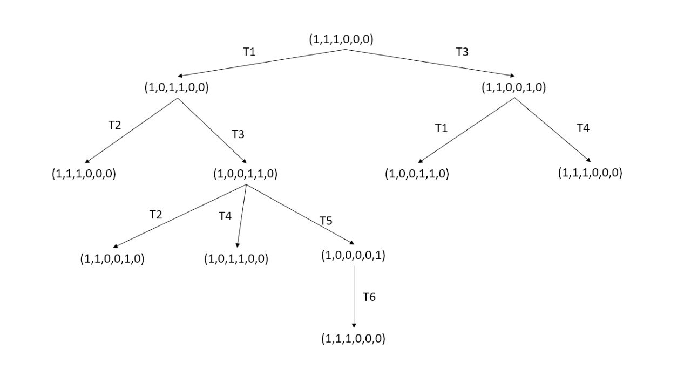
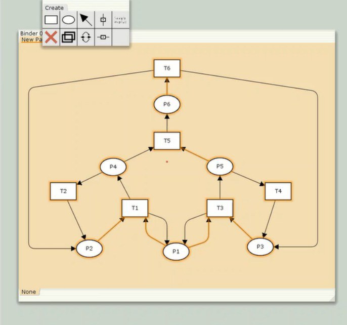
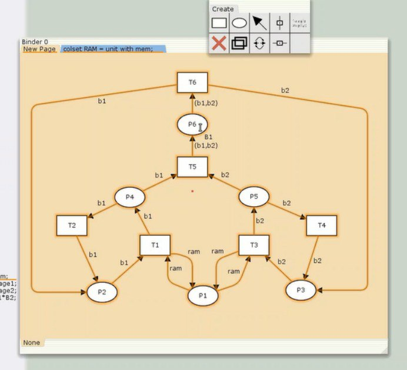
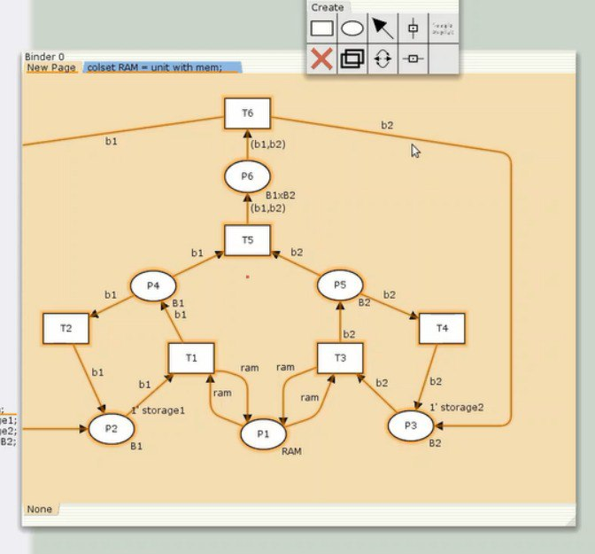
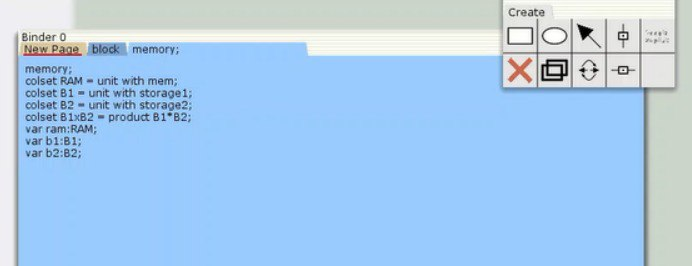
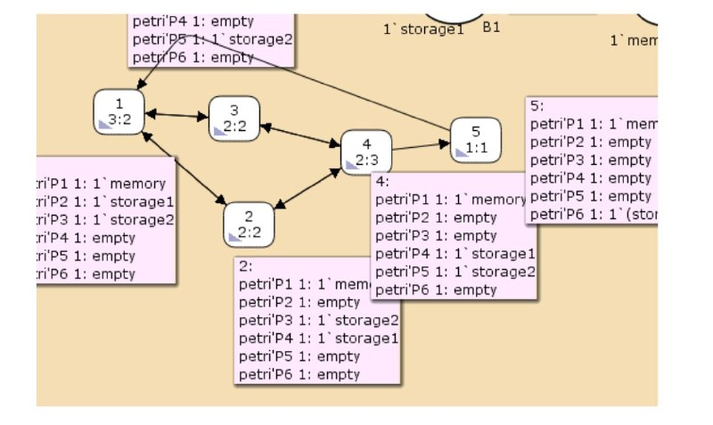

---
## Front matter
lang: ru-RU
title: Лабораторная работа №13
author:
  - Машковцева К.С.
institute:
  - Российский университет дружбы народов

## i18n babel
babel-lang: russian
babel-otherlangs: english

## Formatting pdf
toc: false
toc-title: Содержание
slide_level: 2
aspectratio: 169
section-titles: true
theme: metropolis
header-includes:
 - \metroset{progressbar=frametitle,sectionpage=progressbar,numbering=fraction}
 - '\makeatletter'
 - '\beamer@ignorenonframefalse'
 - '\makeatother'
---

# Информация

## Докладчик

:::::::::::::: {.columns align=center}
::: {.column width="60%"}

  * Машковцева Ксения Сергеевна
  * студентка
  * Российский университет дружбы народов

:::
::: {.column width="25%"}


:::
::::::::::::::

## Цели и задачи

**Цель работы**

Создать модель сети Петри и проанализировать ее

**Задание**

1. Провести анализ сети
2. Определить является ли сеть безопасной, ограниченной, сохраняющей, имеются ли тупики
3. Промоделировать сеть Петри при помощи CPNtools
4. Вычислить пространство состояний.

## Выполнение лабораторной работы

{#fig:001 width=70%}

## Выполнение лабораторной работы

{#fig:002 width=70%}

## Выполнение лабораторной работы

{#fig:003 width=70%}

## Выполнение лабораторной работы

{#fig:004 width=70%}

## Выполнение лабораторной работы

{#fig:005 width=70%}

## Статистика

```
Statistics
------------------------------------------------------------------------

  State Space
     Nodes:  5
     Arcs:   10
     Secs:   0
     Status: Full

  Scc Graph
     Nodes:  1
     Arcs:   0
     Secs:   0
```

## Упражнение

```
 Boundedness Properties
------------------------------------------------------------------------

  Best Integer Bounds
                             Upper      Lower
     petri'P1 1              1          1
     petri'P2 1              1          0
     petri'P3 1              1          0
     petri'P4 1              1          0
     petri'P5 1              1          0
     petri'P6 1              1          0

```

## Упражнение

{#fig:007 width=70%}

## Выводы

Мы провели анализ сети, выяснили, что она безопасна, ограниченна и не имеет тупиков, а также построили реализацию в CPNtools и вычислили пространство состояний. 
