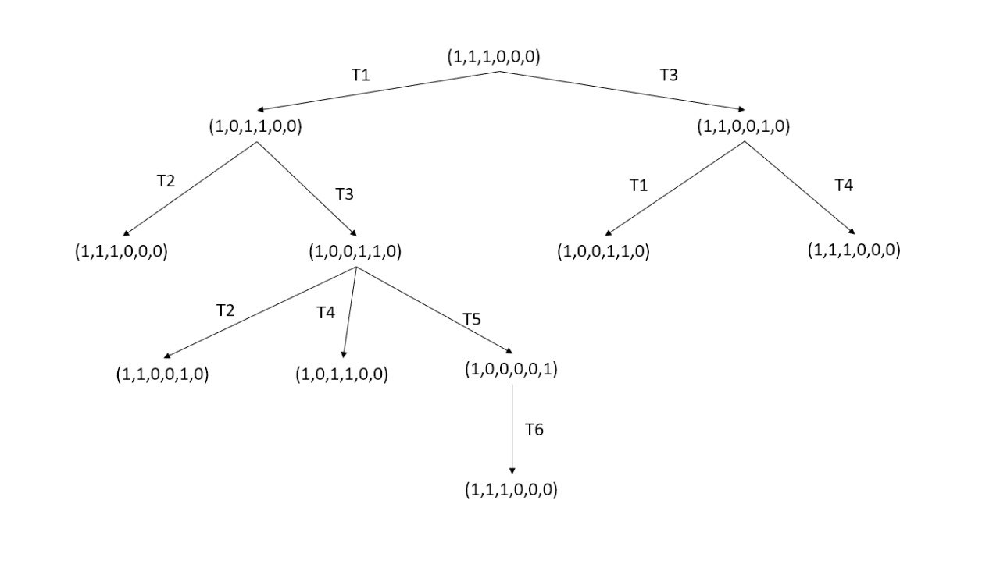
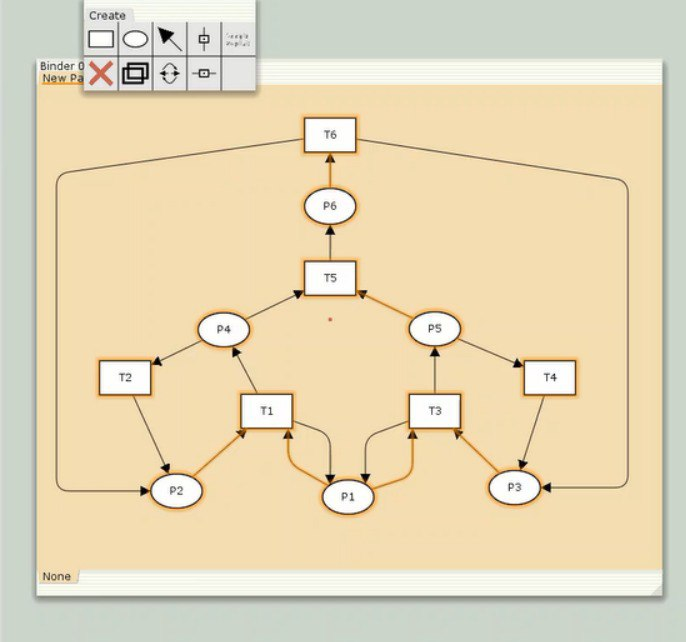
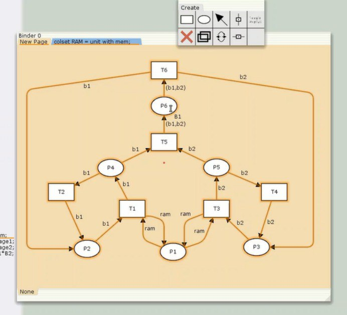
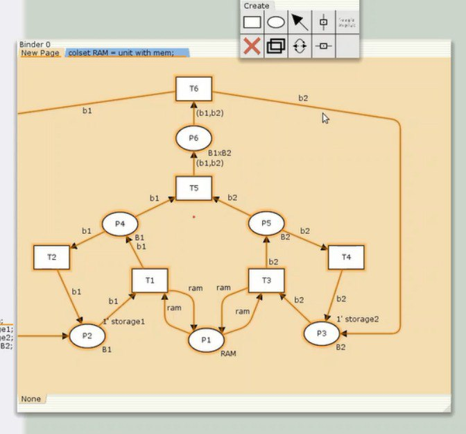
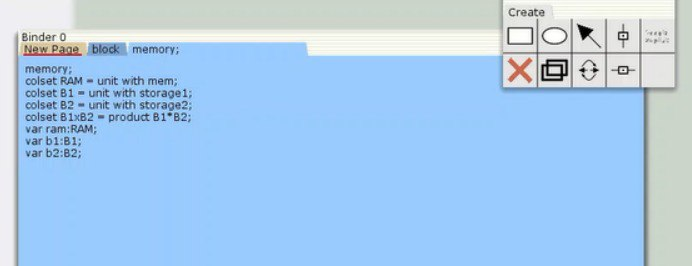

---
## Front matter
title: "Отчет оп лабораторной работе 13"
subtitle: "Имитационное моделирование"
author: "Машковцева Ксения, НКНбд-01-22"

## Generic otions
lang: ru-RU
toc-title: "Содержание"

## Bibliography
bibliography: bib/cite.bib
csl: pandoc/csl/gost-r-7-0-5-2008-numeric.csl

## Pdf output format
toc: true # Table of contents
toc-depth: 2
lof: true # List of figures
lot: true # List of tables
fontsize: 12pt
linestretch: 1.5
papersize: a4
documentclass: scrreprt
## I18n polyglossia
polyglossia-lang:
  name: russian
  options:
	- spelling=modern
	- babelshorthands=true
polyglossia-otherlangs:
  name: english
## I18n babel
babel-lang: russian
babel-otherlangs: english
## Fonts
mainfont: IBM Plex Serif
romanfont: IBM Plex Serif
sansfont: IBM Plex Sans
monofont: IBM Plex Mono
mathfont: STIX Two Math
mainfontoptions: Ligatures=Common,Ligatures=TeX,Scale=0.94
romanfontoptions: Ligatures=Common,Ligatures=TeX,Scale=0.94
sansfontoptions: Ligatures=Common,Ligatures=TeX,Scale=MatchLowercase,Scale=0.94
monofontoptions: Scale=MatchLowercase,Scale=0.94,FakeStretch=0.9
mathfontoptions:
## Biblatex
biblatex: true
biblio-style: "gost-numeric"
biblatexoptions:
  - parentracker=true
  - backend=biber
  - hyperref=auto
  - language=auto
  - autolang=other*
  - citestyle=gost-numeric
## Pandoc-crossref LaTeX customization
figureTitle: "Рис."
tableTitle: "Таблица"
listingTitle: "Листинг"
lofTitle: "Список иллюстраций"
lotTitle: "Список таблиц"
lolTitle: "Листинги"
## Misc options
indent: true
header-includes:
  - \usepackage{indentfirst}
  - \usepackage{float} # keep figures where there are in the text
  - \floatplacement{figure}{H} # keep figures where there are in the text
---

# Цель работы

Провести анализ сети, определить является ли сеть безопасной, ограниченной, сохраняющей, имеются ли тупики, а также промоделировать сеть Петри при помощи CPNtools и вычислить пространство состояний.

# Выполнение лабораторной работы

Заявка первым делом поступает в оперативную память, затем передается в CPU, после этого заявка может с равной вероятностью обратиться к оперативной памяти или к одному из записывающих устройств B1 или B2.

Построим дерево достижимости (рис. [-@fig:001]).

{#fig:001 width=70%}

Можем увидеть, что дерево показывает:

1. безопасность данной сети, поскольку количество фишек в одной позиции единовременно не превышает 1 

2. ограниченность, так как число фишек не может превысить трех

3. Сеть не имеет тупиков

4. сохранность, так при некоторых переходах количество фишек изменяется

В дальнейшем мы строим модель сети Петри в CPNtools (рис. [-@fig:002]).

{#fig:002 width=70%}

На графике мы видим шесть позиций и шесть переходов. На следующем этапе мы добавляем переменные и как они двигаются (рис. [-@fig:003]).

{#fig:003 width=70%}

В конце мы добавляем типы данных, сообщения (рис. [-@fig:004]).

{#fig:004 width=70%}

Также необходимо добавить декларацию с типами данных B1, B2, RAM и переменными b1, b2, ram этих типов (рис. [-@fig:005]).

{#fig:005 width=70%}

# Выводы

Мы провели анализ сети, выяснили, что она безопасна, ограниченна и не имеет тупиков, а также построили реализацию в CPNtools и вычислили пространство состояний. 
