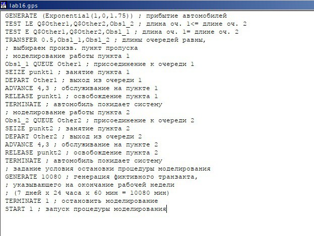
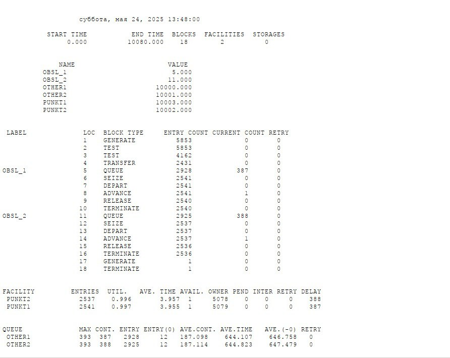
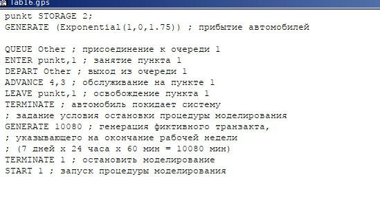
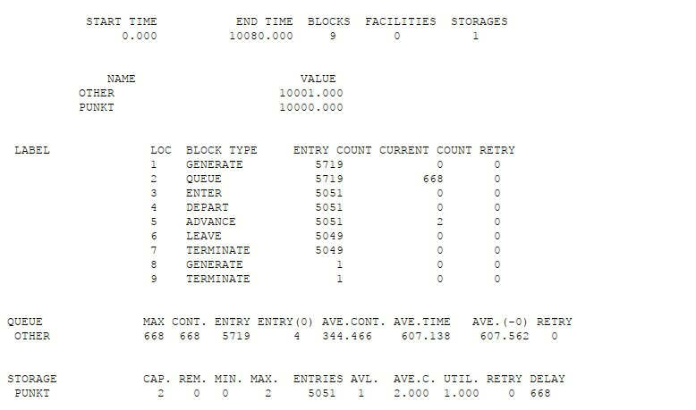
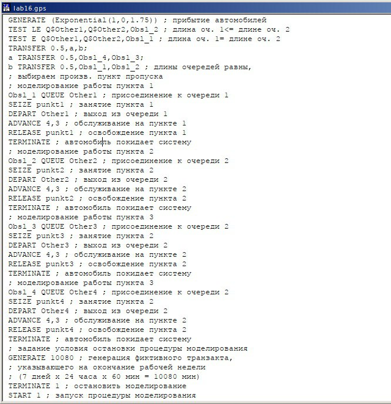
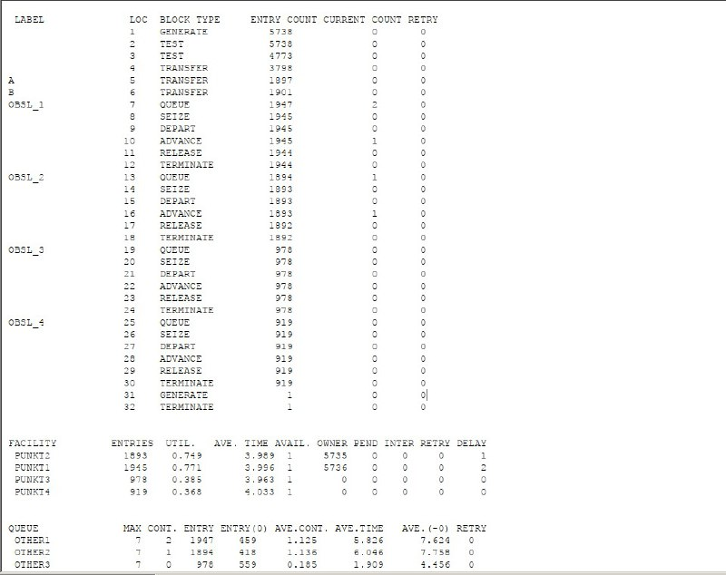
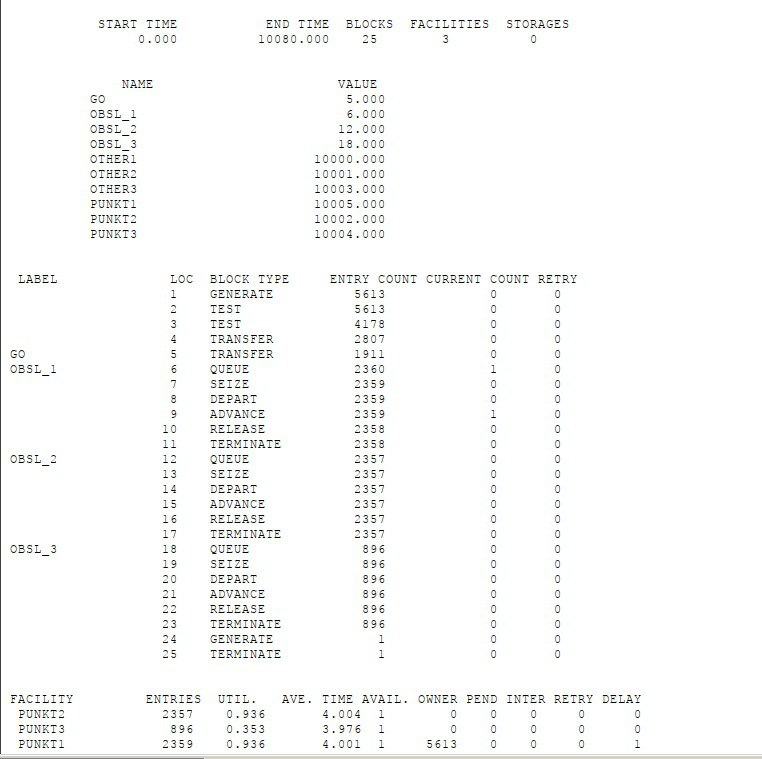

---
## Front matter
title: "Отчет оп лабораторной работе 16"
subtitle: "Имитационное моделирование"
author: "Машковцева Ксения, НКНбд-01-22"

## Generic otions
lang: ru-RU
toc-title: "Содержание"

## Bibliography
bibliography: bib/cite.bib
csl: pandoc/csl/gost-r-7-0-5-2008-numeric.csl

## Pdf output format
toc: true # Table of contents
toc-depth: 2
lof: true # List of figures
lot: true # List of tables
fontsize: 12pt
linestretch: 1.5
papersize: a4
documentclass: scrreprt
## I18n polyglossia
polyglossia-lang:
  name: russian
  options:
	- spelling=modern
	- babelshorthands=true
polyglossia-otherlangs:
  name: english
## I18n babel
babel-lang: russian
babel-otherlangs: english
## Fonts
mainfont: IBM Plex Serif
romanfont: IBM Plex Serif
sansfont: IBM Plex Sans
monofont: IBM Plex Mono
mathfont: STIX Two Math
mainfontoptions: Ligatures=Common,Ligatures=TeX,Scale=0.94
romanfontoptions: Ligatures=Common,Ligatures=TeX,Scale=0.94
sansfontoptions: Ligatures=Common,Ligatures=TeX,Scale=MatchLowercase,Scale=0.94
monofontoptions: Scale=MatchLowercase,Scale=0.94,FakeStretch=0.9
mathfontoptions:
## Biblatex
biblatex: true
biblio-style: "gost-numeric"
biblatexoptions:
  - parentracker=true
  - backend=biber
  - hyperref=auto
  - language=auto
  - autolang=other*
  - citestyle=gost-numeric
## Pandoc-crossref LaTeX customization
figureTitle: "Рис."
tableTitle: "Таблица"
listingTitle: "Листинг"
lofTitle: "Список иллюстраций"
lotTitle: "Список таблиц"
lolTitle: "Листинги"
## Misc options
indent: true
header-includes:
  - \usepackage{indentfirst}
  - \usepackage{float} # keep figures where there are in the text
  - \floatplacement{figure}{H} # keep figures where there are in the text
---

# Цель работы

Создать две стратегии обслуживания, сравнить их и выявить лучшую

# Выполнение лабораторной работы

Первая стратегия - две очереди машин на пропускные пункты или 2 facilities (рис. [-@fig:001]).

{#fig:001 width=70%}

В отчете по первой стратегии мы видим, что среднее время обслуживания составило в каждой из очередей около четырех минут (рис. [-@fig:002]).

{#fig:002 width=70%}

Далее вторая стратегия с одной очередью, в которой машина занимает освободившийся пропускной пункт (рис. [-@fig:003]).

{#fig:003 width=70%}

По отчету видно, что было создано меньше машин, но в таблице далее будет очевиднее разница (рис. [-@fig:004]).

{#fig:004 width=70%}

| Показатель                 | стратегия 1 |         |          |  стратегия 2 |
|----------------------------|-------------|---------|----------|--------------|
|                            | пункт 1     | пункт 2 | в целом  |              |
| Поступило автомобилей      | 2928        | 2925    | 5853     | 5719         |
| Обслужено автомобилей      | 2540        | 2536    | 5076     | 5049         |
| Коэффициент загрузки       | 0,997       | 0,996   | 0,9965   | 1            |
| Максимальная длина очереди | 393         | 393     | 786      | 668          |
| Средняя длина очереди      | 187,098     | 187,114 | 374,212  | 344,466      |
| Среднее время ожидания     | 644,107     | 644,823 | 644,465  | 607,138      |

Далее мы сравниваем количество пропускных пунктов в первой стратегии от 1 до 4 (рис. [-@fig:005]).

{#fig:005 width=70%}

Отчет по четырем пропускным пунктам показывает соответствие двум условиям из трех, кроме среднего числа автомобилей на пунктах - оно равно четырем  (рис. [-@fig:006]).

{#fig:006 width=70%}

В отчете по трем пропускным пунктам видно, что среднее время составило примерно четыре минуты, коэффициент загрузки также соответствует условию и главное - число машин на пунктах никак не может превысить трех (рис. [-@fig:007]).

{#fig:007 width=70%}

# Выводы

Мы создали две стратегии одной модели с пропускными пунктами, сравнили их и выявили как можно оптимизировать одну из них
