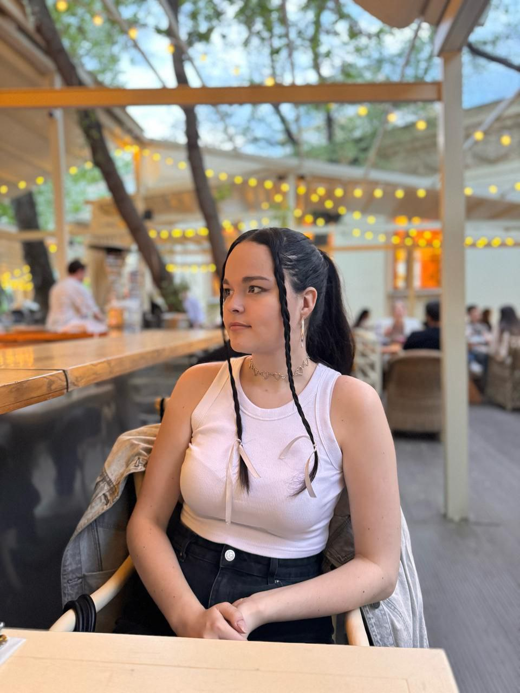
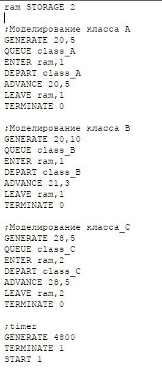
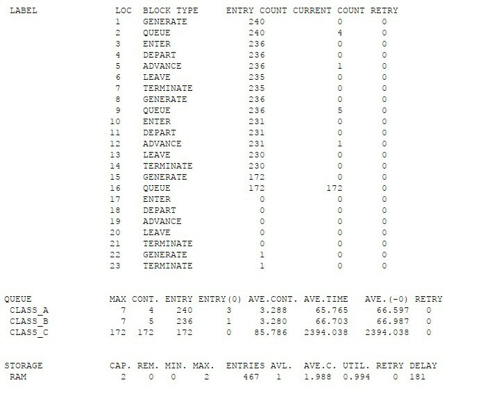
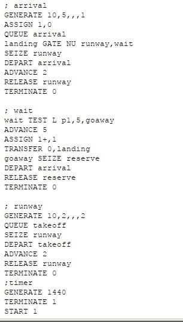
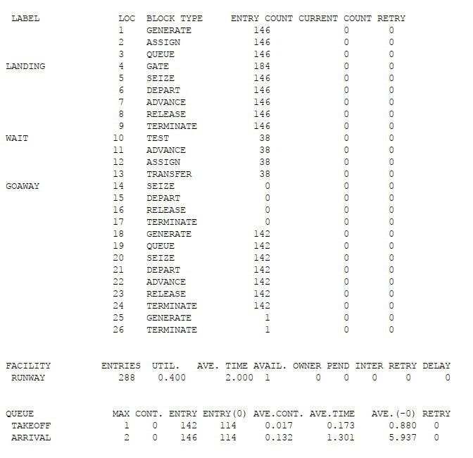
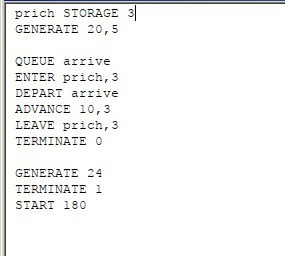
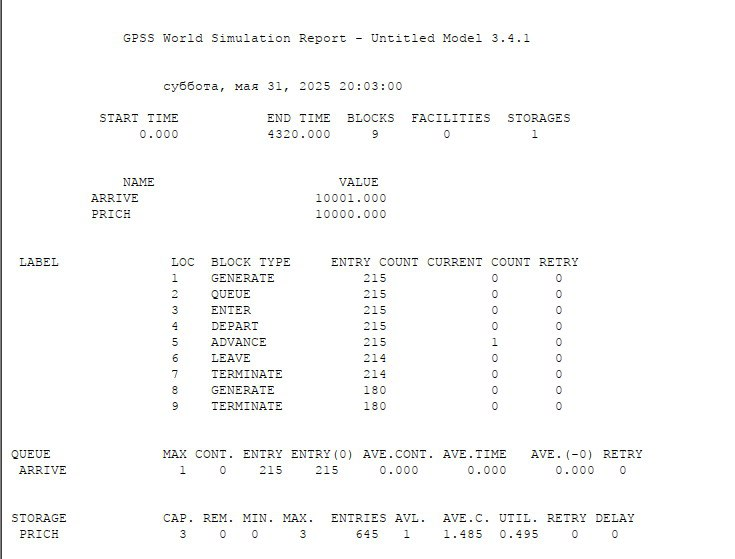
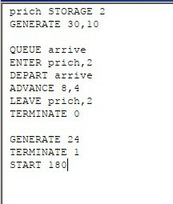
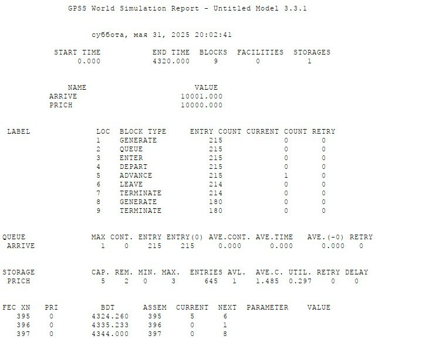

---
## Front matter
lang: ru-RU
title: Лабораторная работа №17
author:
  - Машковцева К.С.
institute:
  - Российский университет дружбы народов

## i18n babel
babel-lang: russian
babel-otherlangs: english

## Formatting pdf
toc: false
toc-title: Содержание
slide_level: 2
aspectratio: 169
section-titles: true
theme: metropolis
header-includes:
 - \metroset{progressbar=frametitle,sectionpage=progressbar,numbering=fraction}
 - '\makeatletter'
 - '\beamer@ignorenonframefalse'
 - '\makeatother'
---

# Информация

## Докладчик

:::::::::::::: {.columns align=center}
::: {.column width="60%"}

  * Машковцева Ксения Сергеевна
  * студентка
  * Российский университет дружбы народов

:::
::: {.column width="25%"}

:::
::::::::::::::

## Цели и задачи

**Цель работы**

Создать три модели на языке GPSS

**Задание**

1. Создать модель ЭВМ с тремя классами
2. Создать модель аэропорта со взлетом и посадкой
3. Создать модель причала

## Выполнение лабораторной работы

{#fig:001 width=70%}

## Выполнение лабораторной работы

{#fig:002 width=70%}

## Выполнение лабораторной работы

{#fig:003 width=70%}

## Выполнение лабораторной работы

{#fig:005 width=70%}

## Выполнение лабораторной работы

{#fig:005 width=70%}

## Выполнение лабораторной работы

{#fig:006 width=70%}

## Выполнение лабораторной работы

{#fig:007 width=70%}

## Выполнение лабораторной работы

{#fig:008 width=70%}

## Выводы

Мы создали три модели на языке GPSS с приоритетами, разными типами данных, используя знания из предыдущих работ
