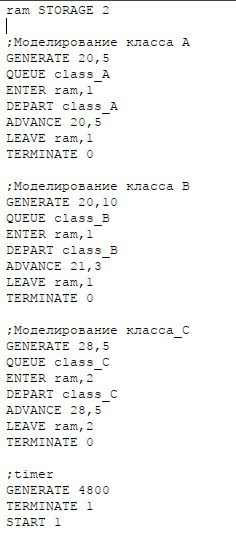
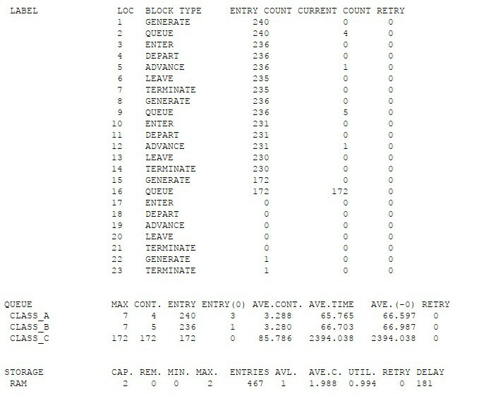
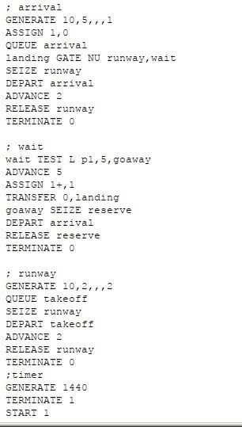
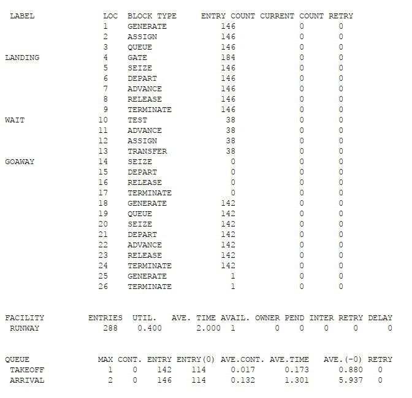
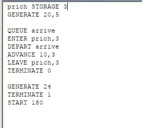
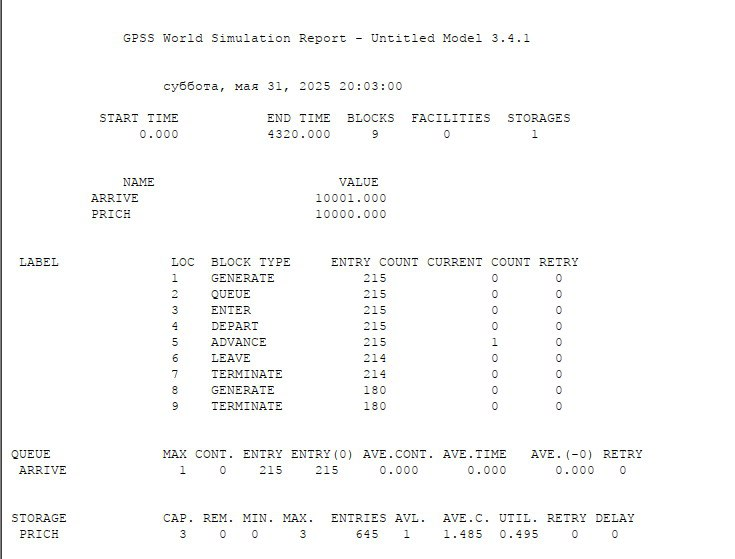
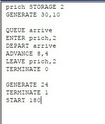
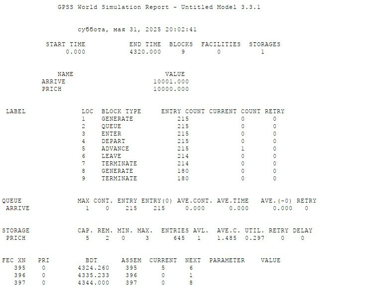

---
## Front matter
title: "Отчет оп лабораторной работе 17"
subtitle: "Имитационное моделирование"
author: "Машковцева Ксения, НКНбд-01-22"

## Generic otions
lang: ru-RU
toc-title: "Содержание"

## Bibliography
bibliography: bib/cite.bib
csl: pandoc/csl/gost-r-7-0-5-2008-numeric.csl

## Pdf output format
toc: true # Table of contents
toc-depth: 2
lof: true # List of figures
lot: true # List of tables
fontsize: 12pt
linestretch: 1.5
papersize: a4
documentclass: scrreprt
## I18n polyglossia
polyglossia-lang:
  name: russian
  options:
	- spelling=modern
	- babelshorthands=true
polyglossia-otherlangs:
  name: english
## I18n babel
babel-lang: russian
babel-otherlangs: english
## Fonts
mainfont: IBM Plex Serif
romanfont: IBM Plex Serif
sansfont: IBM Plex Sans
monofont: IBM Plex Mono
mathfont: STIX Two Math
mainfontoptions: Ligatures=Common,Ligatures=TeX,Scale=0.94
romanfontoptions: Ligatures=Common,Ligatures=TeX,Scale=0.94
sansfontoptions: Ligatures=Common,Ligatures=TeX,Scale=MatchLowercase,Scale=0.94
monofontoptions: Scale=MatchLowercase,Scale=0.94,FakeStretch=0.9
mathfontoptions:
## Biblatex
biblatex: true
biblio-style: "gost-numeric"
biblatexoptions:
  - parentracker=true
  - backend=biber
  - hyperref=auto
  - language=auto
  - autolang=other*
  - citestyle=gost-numeric
## Pandoc-crossref LaTeX customization
figureTitle: "Рис."
tableTitle: "Таблица"
listingTitle: "Листинг"
lofTitle: "Список иллюстраций"
lotTitle: "Список таблиц"
lolTitle: "Листинги"
## Misc options
indent: true
header-includes:
  - \usepackage{indentfirst}
  - \usepackage{float} # keep figures where there are in the text
  - \floatplacement{figure}{H} # keep figures where there are in the text
---

# Цель работы

Создать три модели на языке GPSS

# Выполнение лабораторной работы

Первая модель - модель работы вычислительного центра, в которой А и В классы занимают половину оперативной памяти ЭВМ, а класс С занимает всю вычислительную мощность (рис. [-@fig:001]).

{#fig:001 width=70%}

В отчете мы видим, что класс А и класс В ждут минимально, а класс С очень долго ожидает освобождение очереди, поскольку ему необходима полная мощность ЭВМ (рис. [-@fig:002]).

{#fig:002 width=70%}

Далее вторая модель работы аэропорта, в котором у нас есть одна посадочно-взлетная полоса, самолеты на посадку заходят каждые 10+-5 минут, а на взлет 10+-2 минуты. В приоритете находятся самолеты на взлет, если самолет не смог сесть, он облетает максимум пять кругов по пять минут и в крайнем случае улетает на запасной аэропорт (рис. [-@fig:003]).

{#fig:003 width=70%}

По отчету можно сказать, что самолеты облетали в среднем 1, максимум 2 круга прежде чем благополучно сесть, а аэропорт работал на 0.4 своей полной загрузки (рис. [-@fig:004]).

{#fig:004 width=70%}

Далее у нас была одна модель работы причала с двумя разными списками начальных условий (рис. [-@fig:005]).

{#fig:005 width=70%}

По отчету мы видим, что причал в основном простаивает из-за большего времени между генерациями (прибытиями) судов и небольшой по времени стоянкой кораблей. При оптимальном количестве причалов = 3, кпд причала равно почти 0.5 (рис. [-@fig:006])

{#fig:006 width=70%}

Используем другой набор начальных условий, в котором разница между прибытиями судов еще больше (рис. [-@fig:007]).

{#fig:007 width=70%}

Из-за того. что причалов требуется меньше, а разница во времени больше, даже при минимальном количестве причалов, загрузка модели очень низка, около 0.25 (рис. [-@fig:008]).

{#fig:008 width=70%}

# Выводы

Мы создали три модели на языке GPSS с приоритетами, разными типами данных, используя знания из предыдущих работ
